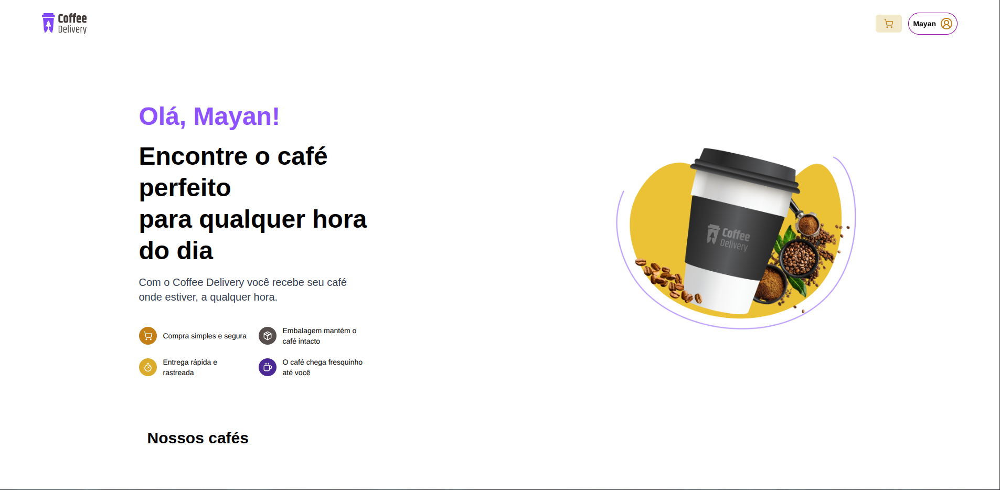

# ☕ Coffee Delivery – Next.js + TypeScript

Um sistema completo de delivery de café desenvolvido com **Next.js**, focado em performance, experiência do usuário e fluxo real de compra.  
O usuário pode navegar pelos cafés, adicionar itens ao carrinho, preencher endereço usando busca automática por **CEP**, escolher forma de pagamento e finalizar o pedido.

---

## 📸 Preview

### 🏠 Home


### 📦 Lista de Cafés


### 🧾 Checkout Completo


---

## 🚀 Tecnologias Utilizadas

### **Frontend**
- **Next.js 14**
- **React 18**
- **TypeScript**
- **Tailwind CSS**
- **Zustand** – gerenciamento global de estado
- **Lucide React** – ícones modernos
- **React Toastify** – alertas e notificações
- **Framer Motion** – animações de transição (usado antes, removido em algumas partes)

---

## 🌐 APIs Utilizadas

### **📌 ViaCEP**
Usada para busca automática de endereço via CEP:
- Rua  
- Bairro  
- Cidade  
- UF  

### **📌 API IBGE**
Usada para listar todas as UFs brasileiras e garantir dados oficiais.

---

## 📦 Bibliotecas Instaladas

```json
{
  "framer-motion": "^12.23.24",
  "lucide-react": "^0.544.0",
  "react-toastify": "^11.0.5",
  "zustand": "^5.0.8"
}
```

---

## 🧰 Como Rodar o Projeto

```bash
npm install
npm run dev
```

---

## ✨ Funcionalidades do Projeto

### 🛍️ Catálogo de Cafés
- Lista de produtos com nome, descrição e categorias
- Controle de quantidade
- Botão para adicionar ao carrinho

### 🛒 Carrinho
- Gerenciamento global com Zustand
- Atualizar quantidade
- Remover item
- Cálculo automático de subtotal, entrega e total

### 📍 Checkout com Busca de CEP
- Busca automática via ViaCEP
- Preenchimento automático de endereço
- Seleção de UF vindo da API do IBGE
- Tratamento e validação dos inputs

### 💳 Métodos de Pagamento
- Crédito
- Débito
- Dinheiro
- PIX

### 🔐 Sessão de Segurança
- Ícones de site seguro
- Certificação SSL
- Proteção antifraude

---

## 🗂 Estrutura Simplificada do Projeto

```
src/
 ├─ app/
 │   ├─ checkout/
 │   ├─ components/
 │   ├─ (home)/
 │   └─ ...
 ├─ lib/
 │   ├─ ApiIBGE.ts
 │   └─ fetchCep.ts
 ├─ store/
 │   ├─ useCartStore.ts
 │   └─ useLocationStore.ts
 └─ data/
```

---

## 🏁 Status do Projeto

- ✔ UI pronta
- ✔ Carrinho funcional
- ✔ Checkout completo
- ✔ Integração com APIs reais
- ✔ Código limpo e componentizado

---

## 📄 Licença

Este projeto é livre para estudos e portfólio.
```